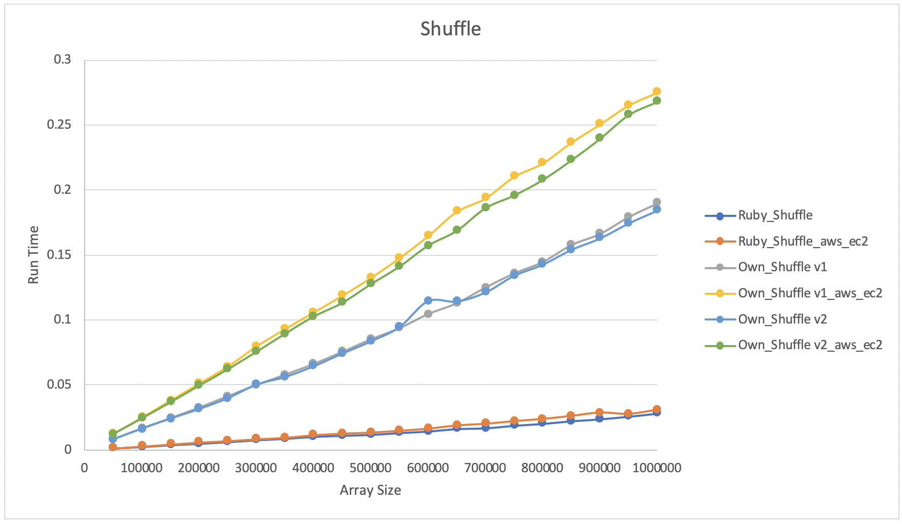

# Algorithmic Complexity

## Introduction
Makers post-course series of workshops aimed at learning/investigating how efficient algorithms are and use that to improve the speed of our own programmes

## Shuffle

- Ruby native array shuffle method compared against my own implementation for run time
- Also compares my own Mac against AWS EC2 VM

- All imlementations linear O(n)
- Ruby shuffle method significantly quicker, presumably because my own code has to go through the Ruby interpreter and the native method is implmented in C behind the scenes???

