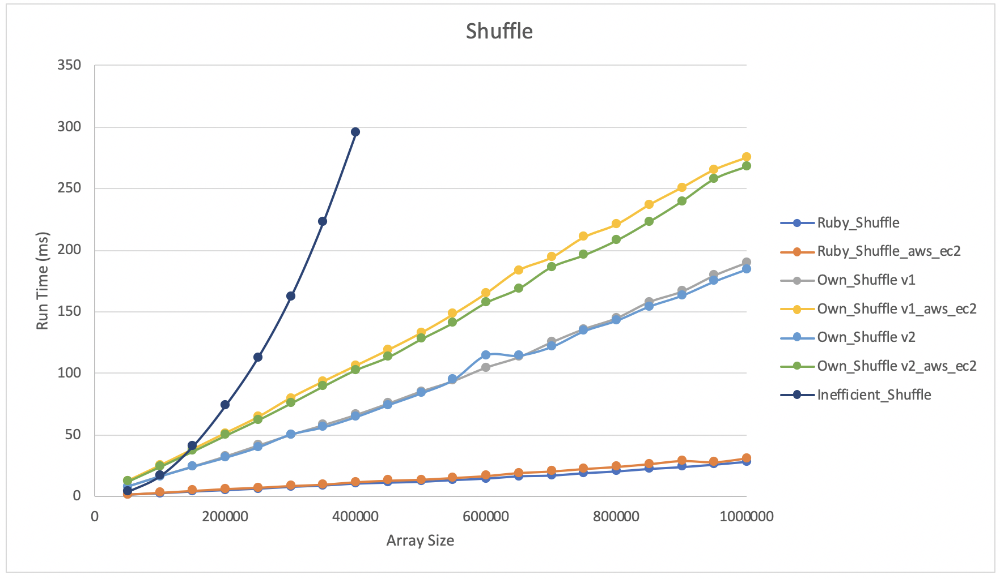
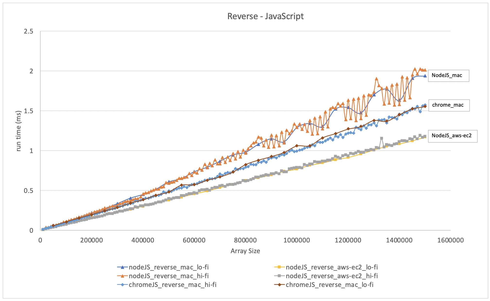
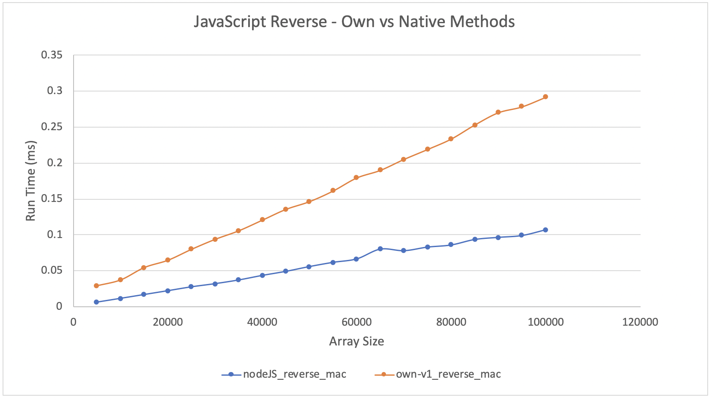

# Algorithmic Complexity

## Introduction
Makers post-course series of workshops aimed at learning/investigating how efficient algorithms are and use that to improve the speed of our own programmes

## Shuffle

### Ruby

- Ruby native array shuffle method compared against my own implementation for run time
- Also compares my own Mac against AWS EC2 VM

- All imlementations linear O(n)
- Ruby shuffle method significantly quicker, presumably because my own code has to go through the Ruby interpreter and the native method is implmented in C behind the scenes???

## Reverse

### JavaScript

- Native JS reverse method time complexity assessed
- Initially run with NodeJS (v12.14.0) on mac array size 50,000 - 1,500,0000 at 50,000 intervals. This showed instability in the timings at larger array sizes
- Investigated by running at a higher fidelity (10,000 intervals), this again confirmed fairly unstable times show instability at larger array sizes
- Investigated further by running same code on aws-ec2 VM and chrome browser (both lo-fi and hi-fi). These show much more consistent linear curves.

- JS native revers method compared againt own version
- Node JS on mac used, smaller array sizes chosen to avoid instability seen above
- Both exhibit linear time complexity, O(n)
- Native method significantly faster, which is to be expected

