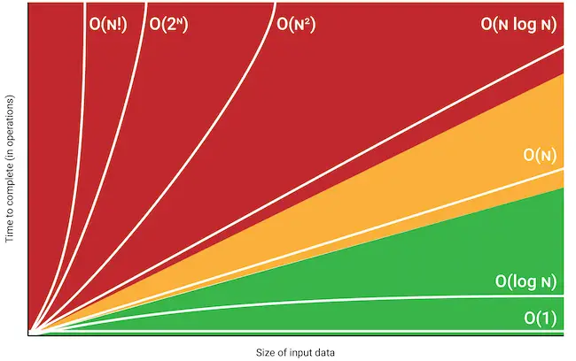
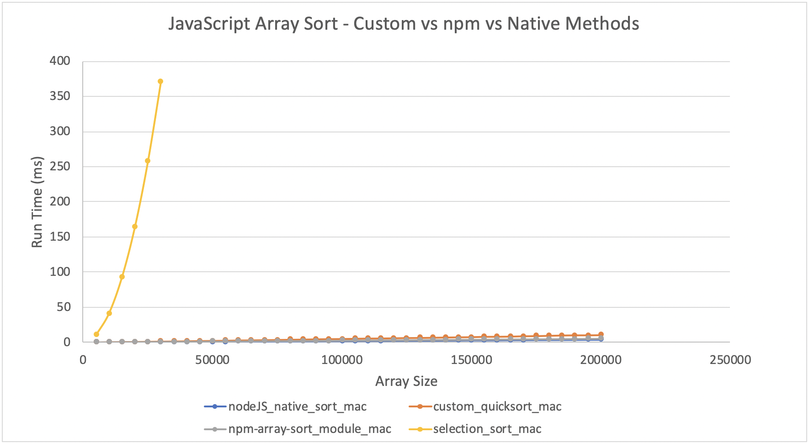

# Algorithmic Complexity

## Introduction
Makers post-course series of workshops aimed at learning/investigating time and space complexity of algorithms. Initially this involves developing a timing framework to measure performance, which I will use study and compare language native functions (such as 'Sort' or 'Reverse') against my own implementations. Following this I will use the timing framework to benchmark solutiuons to codewars kata and then use this information to discuss the complexity and see if I can refactor to more efficient solutions

Course Material: [Here](https://github.com/makersacademy/course/tree/master/algorithmic_complexity)

## Reverse (JavaScript/NodeJS)

- Native JS reverse method time complexity assessed
- Initial study to gauge how Node and browser based Javascript compare as well as get a feel for what array sizes would be best to assess the algorithms
- Initially run with NodeJS (v12.14.0) on mac array size 50,000 - 1,500,0000 at 50,000 intervals. This showed instability in the timings at larger array sizes
- Investigated by running at a higher fidelity (10,000 intervals), this again confirmed fairly unstable times show instability at larger array sizes
- Investigated further by running same code on aws-ec2 VM and chrome browser (both lo-fi and hi-fi). These show much more consistent linear curves.

- JS native reverse method compared against custom implementation
- Node JS on mac used, smaller array sizes (5000 - 200000, 5000 intervals) chosen to avoid instability seen above
- Both exhibit linear time complexity, O(n)
- native method marginally faster
- custom implementation traverses the array from both ends, meeting in the middle, hence will scale linearly in terms of time complexity - O(n)
- The array is modified "in-place" (ie a copy of the array is not made), hence has a constant space complexity - O(1)

## Sort

### JavaScript

- JS native sort method compared against custom implementation (quick sort method)
- Node JS on mac used, array size 5000 - 200000 elements at 5000 intervals

## Shuffle (Ruby)

- Ruby native array shuffle method compared against my own implementation for run time
- Also compares my own Mac against AWS EC2 VM

- All imlementations linear O(n)
- Ruby shuffle method significantly quicker, presumably because my own code has to go through the Ruby interpreter and the native method is implmented in C behind the scenes???

